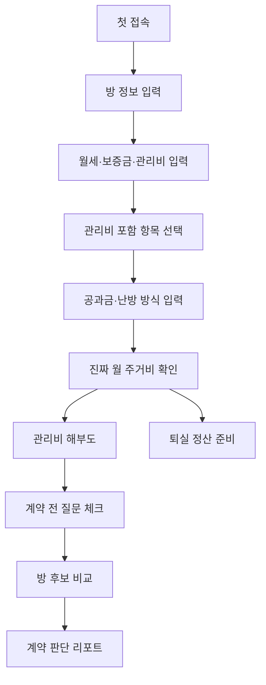

# 원룸 생활비 투명화 도우미 제품 사양서 v0.1

## 1. 서비스 정의

원룸 생활비 투명화 도우미는 월세, 관리비, 전기·가스·수도, 인터넷, 보증금 기회비용, 퇴실 정산 리스크를 합쳐 **이 방이 실제로 한 달에 얼마짜리인지** 보여주는 1인 가구용 주거비 계산 웹서비스입니다.

## 2. 핵심 고객

### 1차 고객

24~34세 사회초년생, 첫 자취생, 상경 직장인, 계약 갱신 또는 이사 예정자.

| 항목 | 내용 |
|---|---|
| 주거 형태 | 원룸, 오피스텔, 다가구, 도시형생활주택 |
| 주요 고민 | 월세 외 관리비와 공과금 총액을 모름 |
| 불안 요소 | 관리비 항목, 계절별 공과금, 퇴실 정산, 보증금 차감 |
| 결제 명분 | 계약 전 손해를 줄일 수 있다면 월 3,900원 가능 |

## 3. MVP 핵심 가치

> 월세만 보지 말고, 진짜 한 달 방값을 보세요.

이 시제품은 부동산 매물 검색이 아니라 **방 비용 해석**에 집중합니다.

## 4. v0.1 기능 범위

| 우선순위 | 기능 | 설명 |
|---|---|---|
| P1 | 진짜 월 주거비 계산 | 월세+관리비+공과금+기타비용 합산 |
| P1 | 관리비 해부도 | 포함/미포함/확인 필요 항목 구분 |
| P1 | 공과금 계절 시뮬레이터 | 여름·겨울 변동 예상 |
| P1 | 방 후보 비교 | A/B/C방 실제 월비용 비교 |
| P1 | 계약 전 질문 체크리스트 | 중개사·임대인에게 물어볼 질문 생성 |
| P1 | 퇴실 정산 계산 | 보증금 반환 예상과 차감 항목 표시 |
| P2 | 월별 고지서 기록 | 계약 후 지속 사용 기능 |
| P2 | PDF/Markdown 리포트 | 계약 전 공유용 비교표 |

## 5. 사용자 흐름



## 6. 핵심 계산

### 진짜 월 주거비

```text
진짜 월 주거비 = 월세 + 관리비 + 별도 전기 + 별도 가스 + 별도 수도 + 인터넷/TV + 주차비 + 기타 월 고정비 + 보증금 기회비용 월환산
```

### 보증금 기회비용

```text
보증금 기회비용 월환산 = 보증금 × 연 기준금리 또는 사용자 설정 수익률 ÷ 12
```

### 비용 투명도 점수

100점에서 시작해 아래 요소를 차감합니다.

- 관리비 세부 항목 미입력
- 전기 계량기 단독 여부 미확인
- 가스 납부 방식 미확인
- 수도 포함 여부 불명확
- 계약서 관리비 기재 미확인
- 퇴실 청소비·수리비 기준 미확인
- 실제 고지서 기록 없음

## 7. 성공 기준

| 지표 | 목표 |
|---|---|
| 첫 방 정보 입력 | 3분 이내 |
| 첫 진짜 월 주거비 확인 | 입력 후 즉시 |
| 관리비 포함/미포함 이해 | 10초 이내 |
| 계약 질문 생성 | 첫 이용 중 1회 이상 |
| 방 후보 비교 | 첫 이용 중 2개 이상 입력 |
| 유료화 반응 | 계약 전이라면 3,900원 지불 의향 |

## 8. 신뢰 문구

모든 주요 계산 화면에는 다음 맥락을 유지합니다.

> 이 결과는 사용자가 입력한 정보와 시제품 계산 규칙을 바탕으로 한 참고용 추정입니다. 실제 관리비, 공과금, 보증금 정산, 계약 조건은 계약서와 공식 고지서, 임대인·중개사 확인 내용에 따라 달라질 수 있습니다.
