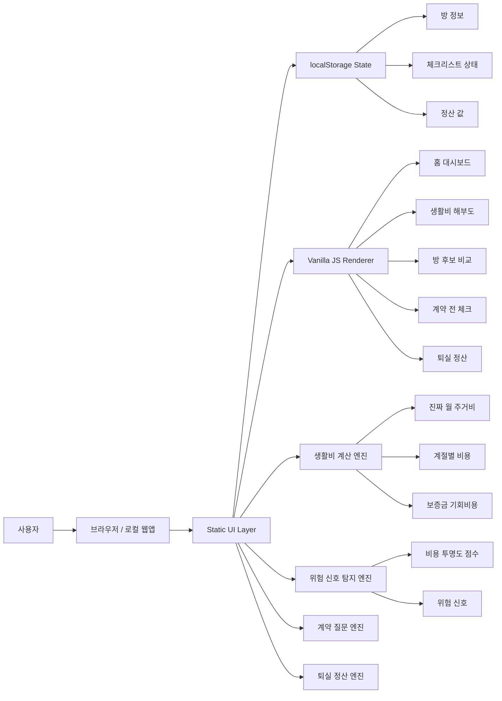
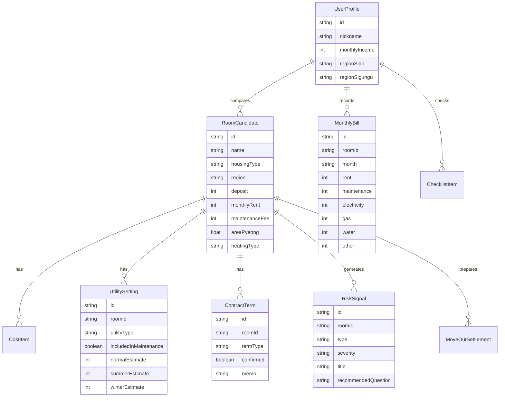

# 시스템 구조도

## 1. 로컬 시제품 구조



## 2. 주요 모듈

| 모듈 | 역할 |
|---|---|
| `src/main.js` | UI 렌더링과 이벤트 바인딩 |
| `src/data/mockRooms.js` | 방 후보, 관리비, 공과금 목업 데이터 |
| `src/engines/costEngine.js` | 주거비 계산, 계절별 비용, 보증금 기회비용 |
| `src/engines/riskEngine.js` | 투명도 점수, 위험 신호 탐지 |
| `src/engines/checklistEngine.js` | 계약 전 질문 체크리스트 생성 |
| `src/engines/settlementEngine.js` | 퇴실 정산 예상 |
| `src/styles.css` | 디자인 시스템과 반응형 스타일 |

## 3. 데이터 모델



## 4. 계산 엔진

### 진짜 월 주거비

```text
total = rent + maintenance + utilities + internet + parking + other + depositOpportunityCost
```

### 계절별 비용

- normal: 평상시 전기/가스 기준
- summer: 여름 전기 기준
- winter: 겨울 가스/난방 기준

### 투명도 점수

100점 기준에서 아래 항목 차감:

- 관리비 세부항목 부족
- 전기 계량기 단독 여부 미확인
- 가스 납부 방식 미확인
- 난방 방식 미확인
- 퇴실 청소비 기준 미확인
- 수리비 기준 미확인
- 계약서 관리비 기재 미확인
- 월별 고지서 기록 없음

## 5. 향후 확장 구조

v1 이후 아래 provider interface를 추가합니다.

```text
features/providers/
├─ utilityRateProvider.js
├─ apartmentFeeProvider.js
├─ listingParserProvider.js
└─ ocrProvider.js
```

실제 연동 후보:

- 한국전력 전기요금 계산기 또는 요금표 참고
- K-apt 공동주택관리정보시스템 데이터 참고
- 부동산 매물 URL 텍스트 분석
- 고지서 OCR

v0.1에서는 실제 API 호출을 하지 않습니다.
