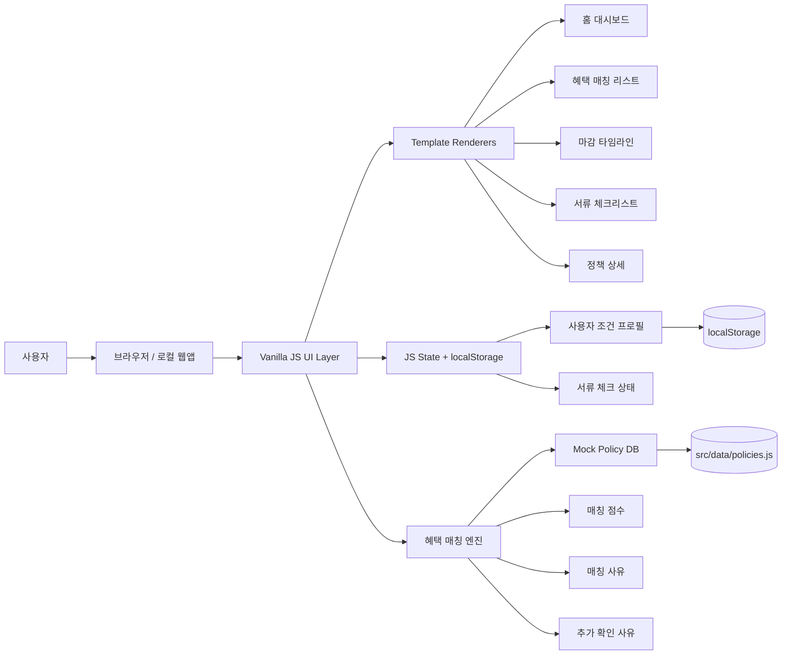
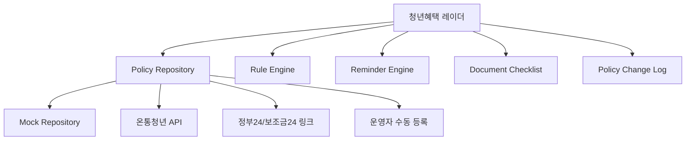

# 시스템 구조도

## v0.1 로컬 시제품 구조

## 코드 배치

| 영역 | 위치 |
|---|---|
| 정책 목업 DB | `src/data/policies.js` |
| 매칭 엔진 | `src/features/matching.js` |
| 마감 계산 | `src/features/deadlines.js` |
| 서류 계산 | `src/features/documents.js` |
| 포맷 유틸 | `src/lib/format.js` |
| localStorage | `src/lib/storage.js` |
| 화면 렌더링 | `src/main.js` |

## v1 확장 구조

## 개인정보 원칙

- 생년월일 대신 만 나이
- 정확한 연봉 대신 소득 구간
- 상세주소 대신 시/도, 시/군/구
- 회사명 대신 재직 상태/회사 유형
- v0.1은 서버 전송 없음
- 사용자가 조건을 초기화할 수 있어야 함
